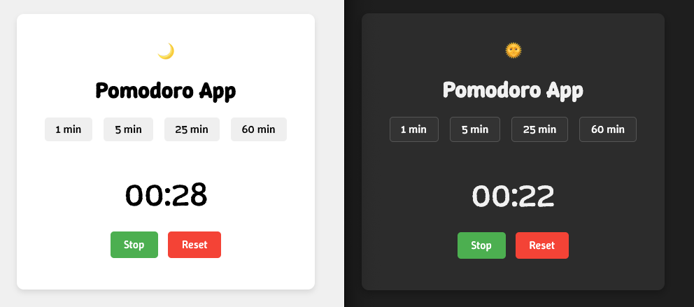

# Pomodoro App

A simple Pomodoro Timer App built with Vanilla JS to boost productivity by helping users stay focused.

## Technologies Used
- Vanilla JS
- CSS (BEM methodology)
- Normalize.css
- Google Fonts

## Live Demo
Check out the live demo: [Pomodoro App Demo](https://dor-ka.github.io/frontend-vanilla-js-pomodoro-app/)

## Screenshots

## Features
## Installation
1. Clone the repository: `git clone https://github.com/Dor-Ka/frontend-vanilla-js-pomodoro-app`
2. Open `index.html` in your browser.

## Usage
- Click **Start** to begin a 25-minute session.
- Click **Stop** to pause the timer.
- Click **Reset** to reset the timer back to 25 minutes.
- Click the **theme toggle button** to switch between light and dark themes.

### v0.1
- Timer (25 minutes work, with start, stop, and reset functionality)
- Simple and clean user interface

### v0.2
- Sound feedback when timer starts and stops
- Alarm sound when the 25-minute session ends
- Preserve timer state using localStorage (survive page refresh).

### v0.3
- Implement dark mode with toggle button.
- Save user theme preference in localStorage.
- Improve alarm Sound Control
  - Added ability to stop alarm sound when user starts or resets the timer
  - Clicking anywhere on the Pomodoro container also stops the alarm
  - Improved UX by resetting alarm playback state (pause and rewind)

### v1.0
- Add customizable session length with buttons (1, 5, 25, 60 min)
- Allow quick switching between session lengths
- Improve UI and UX for better flexibility
- Added favicon for the app.
- Added Open Graph meta tags for better social media sharing (Facebook, LinkedIn, etc.).
- Added Twitter Card meta tags for improved presentation on Twitter.
- Added basic SEO meta tags (description, keywords, and robots).
- Configured meta viewport for better responsiveness on mobile devices.

## License
This project is licensed under the MIT License.
